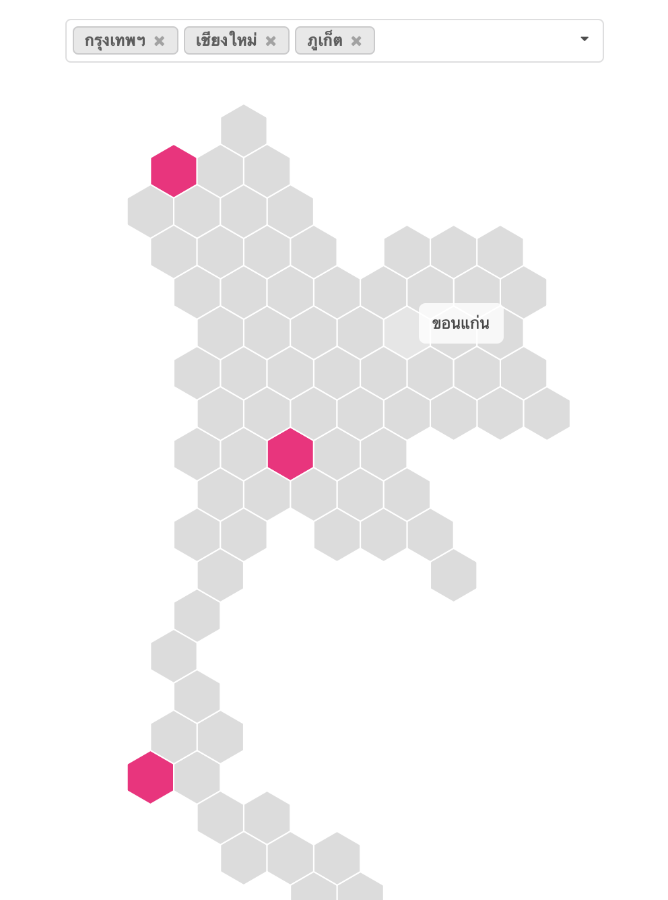

# Hex map of Thailand

A simple tool to generate a hex map of Thailand. The hexes are manually arranged to fit the country's geographical shape. The user interface allows only binary selections but can be easily extended.

